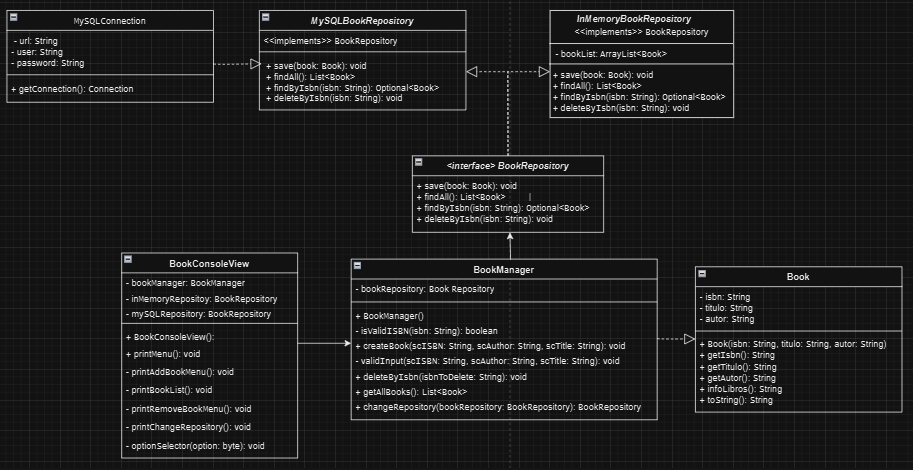

# Tech Books Manager App

**Tech Books Manager** es una aplicación de consola en Java que permite a los usuarios gestionar una colección de libros técnicos de programación. La aplicación proporciona opciones para ver, agregar y eliminar libros, así como cambiar entre diferentes repositorios de datos: en memoria y base de datos MySQL.

---

## Table of Contents
- [Objetivos de Aprendizaje](#objetivos-de-aprendizaje)
- [Descripción General](#descripción-general)
- [Funcionalidades Principales](#funcionalidades-principales)
- [Tecnologías y Conceptos Principales](#tecnologías-y-conceptos-principales)
- [Instalación y Configuración](#instalación-y-configuración)
- [Uso](#uso)
- [Arquitectura](#arquitectura)
- [Diagrama UML Simplificado](#diagrama-uml-simplificado)
- [Pruebas Unitarias](#pruebas-unitarias)
- [User Stories](#user-stories)
- [Desarrolladores](#desarrolladores)

---

## Objetivos de Aprendizaje

Este proyecto se ha realizado en el Bootcamp de Factoría F5 - AWS Backend & Cloud.
- Familiarizarse con los principios de la Programación Orientada a Objetos (OOP) en Java.
- Desarrollar un proyecto utilizando técnicas de desarrollo incremental.
- Aplicar principios de refactorización para mejorar el diseño del código.
- Explorar patrones arquitectónicos como los que se usan en frameworks como Spring.
- Implementar y ejecutar pruebas unitarias básicas.

---

## Descripción General

La aplicación permite gestionar una colección de libros técnicos. Los datos se pueden almacenar temporalmente en memoria o en una base de datos MySQL. El usuario puede interactuar con el sistema a través de un menú de consola, que permite realizar varias operaciones de gestión de libros.

### Funcionalidades Principales

- **Añadir Libros**: Permite agregar un nuevo libro proporcionando el título, autor y un ISBN único.
- **Ver Todos los Libros**: Muestra todos los libros almacenados en el repositorio actual.
- **Eliminar Libros**: Permite eliminar un libro por su ISBN.
- **Cambiar Repositorio**: Cambia el almacenamiento de los datos entre memoria y MySQL.
- **Salir**: Termina la ejecución de la aplicación.

---

## Tecnologías y Conceptos Principales

### Tecnologías Usadas
- **Java 11**: Lenguaje de programación principal utilizado para desarrollar la aplicación.
- **Maven**: Herramienta de construcción y gestión de dependencias.
- **MySQL**: Sistema de gestión de bases de datos utilizado para el almacenamiento persistente.
- **JDBC**: API de Java para conectarse y ejecutar consultas en la base de datos MySQL.
- **XAMPP**: Un paquete de software de servidor gratuito que incluye Apache, MySQL, PHP, y Perl. Se utiliza para ejecutar el servidor MySQL localmente, facilitando la administración de la base de datos a través de herramientas como phpMyAdmin.
- **JUnit 5**: Para pruebas unitarias.
- **Mockito**: Para mockear dependencias y verificar interacciones en los tests.

### Conceptos de Programación
- **Programación Orientada a Objetos (OOP)**: El proyecto se basa en los principios de OOP como encapsulación, herencia y polimorfismo.
    - **Encapsulación**: Se aplicó al definir atributos privados en la clase `Book` con métodos públicos `getters` y `setters`.
    - **Herencia y Polimorfismo**: Se implementó polimorfismo mediante la interfaz `BookRepository`, que tiene múltiples implementaciones (`InMemoryBookRepository` y `MySQLBookRepository`). Esto permite que la aplicación trabaje con diferentes repositorios sin cambiar la lógica de negocio.
- **Principios SOLID**:
    - **Single Responsibility Principle (SRP)**: Cada clase tiene una única responsabilidad. Por ejemplo, la clase `Book` solo se encarga de definir el modelo de un libro, mientras que `MySQLBookRepository` gestiona las operaciones con la base de datos.
    - **Dependency Inversion Principle (DIP)**: La aplicación depende de abstracciones (interfaz `BookRepository`) en lugar de implementaciones concretas. Esto hace que el sistema sea más flexible y fácil de extender.
- **Gestión de Excepciones**: Se manejan las excepciones de base de datos (`SQLException`) para evitar fallos inesperados.
- **Patrón de Diseño Repositorio**: Utilizado para gestionar la persistencia de datos de manera centralizada, lo que facilita el cambio de un tipo de almacenamiento a otro.

---

## Instalación y Configuración

1. **Clonar el repositorio**:
   ```bash
   git clone https://github.com/tuusuario/tech-books-manager.git
   
2. **Configurar la conexión en MySQLConnection.java**:
    ```bash
    private static String url = "jdbc:mysql://localhost:3306/my_database";
    private static String user = "root";
    private static String password = "tu_contraseña";


## Uso
1. **Iniciar la aplicación**: Ejecutar BookConsoleView.java desde tu IDE o usar Maven.
2. **Navegar por el menú**: Usa las opciones del menú para añadir, ver o eliminar libros, y cambiar de repositorio.
    ```bash
   Gestor de Libros Técnicos de Programación
   1. Añadir libro
   2. Ver todos los libros
   3. Eliminar libro
   4. Cambiar repositorio
   5. Salir
      Seleccione una opción:

# Arquitectura
La aplicación sigue una arquitectura básica de capas:

- **Capa de Presentación**: `BookConsoleView` maneja la interacción con el usuario a través de la consola.
- **Capa de Negocio**: `BookManager` gestiona la lógica de negocio.
- **Capa de Persistencia**: `BookRepository`, `InMemoryBookRepository`, y `MySQLBookRepository` se encargan del almacenamiento de datos.

## Diagrama UML Simplificado
El proyecto incluye las siguientes clases principales:

- **Book**: Modelo de datos para un libro.
- **BookManager**: Gestiona la lógica de negocio.
- **BookRepository**: Interfaz para operaciones CRUD.
- **InMemoryBookRepository** y **MySQLBookRepository**: Implementaciones del repositorio.
- **MySQLConnection**: Clase de utilidad para la conexión a la base de datos.
- **BookConsoleView**: Vista de consola para la interacción con el usuario.



## Pruebas Unitarias
El proyecto incluye pruebas unitarias que aseguran que el funcionamiento del sistema sea el esperado. Las pruebas están implementadas utilizando el framework JUnit 5 y la librería Mockito para simular las interacciones con los repositorios y otras dependencias externas.

### Casos de prueba
Algunos de los casos de prueba implementados son los siguientes:

- Guardar un libro: Verifica que un libro se guarda correctamente en el repositorio.
- Encontrar todos los libros: Asegura que se pueden recuperar todos los libros almacenados en el repositorio.
- Buscar un libro por ISBN: Comprueba que se puede encontrar un libro específico dado su ISBN.
- Eliminar un libro por ISBN: Verifica que un libro puede ser eliminado del repositorio.

## User Stories

### Historia de Usuario 1: Ver el Menú Principal
**Descripción**:  
Como usuario, quiero ver un menú en la consola con opciones para gestionar mis libros.

### Historia de Usuario 2: Ver Todos los Libros
**Descripción**:  
Como usuario, quiero ver una lista de todos los libros almacenados.

### Historia de Usuario 3: Añadir un Nuevo Libro
**Descripción**:  
Como usuario, quiero añadir un nuevo libro proporcionando título, autor e ISBN.

### Historia de Usuario 4: Eliminar un Libro
**Descripción**:  
Como usuario, quiero eliminar un libro de mi colección proporcionando el ISBN.

### Historia de Usuario 5: Cambiar el Repositorio
**Descripción**:  
Como usuario, quiero cambiar el tipo de repositorio entre memoria y base de datos MySQL.

## Desarrolladores
 - **Carolay Vasquez** - https://github.com/carovasq
 - **Fran Garcia** - https://github.com/FranGarciaga
 - **Jaime Castro** - https://github.com/JAIMECASTRO-code
 - **Yuliia Bila** - https://github.com/YuliiaBi1a


   
